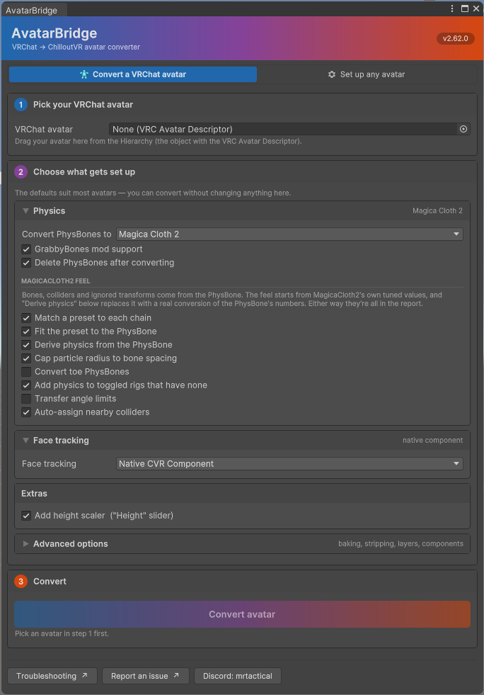

# AvatarBridge — convert your VRChat avatar to ChilloutVR

[](https://github.com/MrTactical/AvatarBridge/releases/latest)
[](LICENSE.md)

A Unity Editor tool that converts a **VRChat SDK3 avatar** into a **ChilloutVR CCK 4 avatar** —
animator, menus, physics, contacts and face tracking — and hands you a clean starting point to
finish by hand.

> ## ✅ It actually works
>
> **30+ avatars converted, uploaded and worn in ChilloutVR** — by the author and by independent
> testers, on other people's models, not just tidy test cases. Heavy ones too: 400k-triangle
> avatars with 56 material slots, full VRCFury rigs, face tracking, the lot.
>
> **And tested *in game*, which is the only test that counts.** An avatar that converts cleanly and
> validates green can still be wrong — a shader drawing into one eye, a chain moving unlike its
> original, a parameter reaching nobody. None of that shows in the editor. So each of these was
> confirmed in a live instance, by wearing it:
>
> - contacts triggered by other players, with real proximity and zero sync cost
> - stereo shaders rendering correctly **in both eyes**
> - prefab constraints driving real bones — Avatar Limb Scaling working end to end
> - PhysBone chains moving like their originals, derived from both solvers' source
> - the "bicycle pose" fixed, confirmed on a tester's avatar
>
> Bugs still turn up — every one above was found this way, by somebody putting an avatar on and
> looking. That's why the report exists and why [reporting a bug](#reporting-a-bug) gets a fix.

<p align="center">
  
</p>

<p align="center"><em>The banner runs VRChat's blue into ChilloutVR's orange, and the step markers
sit along it — because that's the trip your avatar is making.</em></p>

## Already using vrc3cvr?

[vrc3cvr](https://github.com/imagitama/vrc3cvr) is a fine tool and the reason this one exists —
AvatarBridge started by studying it (see [Credits](#credits)). But the two are generations apart
now. What actually differs, as of mid-2026:

| | AvatarBridge | vrc3cvr |
|---|---|---|
| Menus, parameters, gestures | ✅ | ✅ |
| PhysBones → DynamicBone | ✅ 1:1 | ✅ |
| PhysBones → **MagicaCloth2**, feel derived from both solvers' decompiled source | ✅ | — |
| **VRCFury / Modular Avatar baked automatically** (toggles, linked clothing, merged armatures survive) | ✅ | manual |
| VRCFury's sync workarounds removed instead of carried across broken | ✅ | — |
| **ChilloutVR's native contacts** — real proximity, tags verbatim, zero sync cost by design ([beta](#native-contacts)) | ✅ | — |
| Stereo shaders patched so effects stop drawing into one eye | ✅ | — |
| Voice at the mouth and gaze limits, *measured off your avatar's own mesh and poses* | ✅ | — |
| Constraints that drive another transform (Avatar Limb Scaling et al.) | ✅ | — |
| A per-conversion report + diagnostics that know what ChilloutVR deletes on load | ✅ | — |
| Store description generated and typed into the upload page | ✅ | — |

Every ✅ above is documented on this page, and most are confirmed in game — see the banner above
for what that means here.

## It's a head start, not a magic button

AvatarBridge does the tedious ~90%. It does **not** make avatar setup brainless, and can't — the
two platforms differ and VRCFury setups vary endlessly. **It assumes you know your way around
Unity**: the Animator window, blend trees, the `CVRAvatar` component.

Every run writes a `ConversionReport.md` you're **expected to read** — act on each *Warning*,
*Approximated* and *Skipped* entry — and every conversion should be **tested in ChilloutVR** before
you call it done. The editor can't show you gestures, contacts, synced parameters or physics
actually running.

## Highlights

- **VRCFury & Modular Avatar avatars work.** Fury's own builder (or NDMF's bake) runs first, so
  toggles, linked clothing and merged armatures survive — and Fury's VRChat-only sync workarounds
  are removed rather than carried across.
- **PhysBones become real physics** — **MagicaCloth2** or **DynamicBone**, no external tool, with
  the chain's feel converted from the PhysBone's own numbers.
- **Prefabs that drive your bones keep working**, including constraints that target a different
  transform — the way [Avatar Limb Scaling](https://github.com/xNanochip/VRC-Avatar-Limb-Scaling)
  and many others are built.
- **Readable output** — clothing toggles come out as one `Toggle <name>` layer each, on real
  `bool` parameters.
- **Bloat removed** — GoGo Loco and SPS/OGB/PCS stripped (one avatar went from 3088 to 240 of 3200
  sync bits).
- **Face tracking, your way** — native `CVRFaceTracking`, a bundled rig with eye tracking wired
  up, or your avatar's own FT rig converted whole. ARKit and Unified Expressions meshes both work.
- **ChilloutVR's native contacts** — one-to-one, with real proximity and zero sync cost (contacts
  are per-client by design), using a system the CCK doesn't expose ([beta](#native-contacts)).
- **Shaders that lose an eye get fixed** — CVR renders single-pass instanced where VRChat renders
  double-wide, so shaders that never opted in draw into one eye only.
- **Diagnostics that know ChilloutVR** — the report names components CVR silently deletes on load,
  tracks the 3200-bit sync budget, and flags shaders the uploader will reject.
- **The output folder is the whole conversion** — every clip and mask the controller references
  is copied into `RehomedAssets` and the controller repointed, so a conversion survives being
  moved to a project without the source avatar's folders. (One tester's controller referenced 71
  clips — every hand pose included — that lived only next to the source avatar; anywhere else
  they'd play as stillness with no error.) The CCK's own clips stay referenced: uploading
  requires the CCK, so they're always present.
- **A play-mode tester that drives avatars the way the game does** — *Tools → Avatar Bridge →
  CCK Animator Tester*: gestures, locomotion as the exclusive stances the game can actually
  produce (standing, crouching, prone, airborne, flying, sitting, swimming — with Upright
  coupled to stance the way VR height is), visemes, emotes and the avatar's whole Advanced
  Settings menu, coerced by declared type exactly like the client. The menu card follows the
  controller on the avatar's Animator: it refreshes itself when the controller or its parameter
  list changes, and greys any entry whose parameter the controller doesn't declare — driving
  those would do nothing in game either. (VRChat's Gesture Manager cannot drive a converted
  avatar — it needs the VRC descriptor, which conversion removes.)
- **Your avatar writes its own store listing** — counted from what was actually built, sized to
  ChilloutVR's 256-character box, and typed straight into the upload page.

*(No VRChat SDK installed? The tool still runs in [Setup mode](#setup-mode) and prepares any
humanoid for ChilloutVR.)*

## Requirements

| What | Version | Notes |
|---|---|---|
| Unity | **2022.3.22f1** | the version VRChat and CCK 4 both use |
| ChilloutVR CCK | **4.0.x** | always required — it's what the tool builds for |
| VRChat Avatars SDK | SDK3, **via Creator Companion / VPM** | required to convert; without it you get [Setup mode](#setup-mode). The legacy `.unitypackage` SDK cannot coexist with the CCK — see [Troubleshooting](#troubleshooting) |
| [VRCFury](https://vrcfury.com/download) / [Modular Avatar](https://modular-avatar.nadena.dev/) | current | only if your avatars use them |
| [MagicaCloth2](https://assetstore.unity.com/packages/tools/physics/magica-cloth-2-242307) | *optional* | recommended physics target |
| [DynamicBone](https://assetstore.unity.com/packages/tools/animation/dynamic-bone-16743) | *optional* | alternative; the free [VRLabs stub](https://github.com/VRLabs/Dynamic-Bones-Stub) is enough to convert |

Neither physics package is required — choose **Convert PhysBones to → None** and everything else
still converts.

## Installation

> ⚠️ **Import order matters.** Let Unity finish compiling after each step. Importing out of order
> can corrupt VRCFury data or leave broken scripting defines.

1. **Unity 2022.3.22f1**
2. **A copy of your avatar project** — duplicate it. Never convert in your real upload project.
3. **ChilloutVR CCK 4**
4. **A physics package** (optional)
5. **VRCFury / Modular Avatar** — whichever your avatars use
6. **Your avatars** — import any that aren't already there, *after* VRCFury
7. **AvatarBridge, last** — the `.unitypackage` from
   [Releases](https://github.com/MrTactical/AvatarBridge/releases). It must live under `Assets`,
   not `Packages`, or the optional MagicaCloth2 / DynamicBone integration won't resolve.

One extra recompile after importing is normal — that's AvatarBridge registering its scripting
defines.

## Usage

**Tools → Avatar Bridge → VRChat to ChilloutVR Converter**, then:

1. **Pick the avatar** in your scene.
2. **Check the options** — physics target, face tracking mode, height scaler. Defaults suit most
   avatars.
3. **Convert.** Output lands in `Assets/AvatarBridgeOutput/<avatar>/` — a sibling of the tool's
   folder, so deleting `Assets/AvatarBridge` to update it never touches your conversions. Read
   the report, then test in game.

## What gets converted

| VRChat | ChilloutVR | Notes |
|---|---|---|
| Avatar descriptor | `CVRAvatar` | viewpoint, visemes, blink, eye look (gaze limits measured from the poses); voice placed at the mouth, measured from a viseme shape |
| Expression parameters + menus | Advanced Avatar Settings | named after the menu control's label |
| Clothing / prop toggles | one `Toggle <name>` layer each | pulled out of VRCFury's merged blend trees |
| Parameter types | real `bool` / `int` / `float` | see [below](#parameter-types) |
| Gestures | float threshold bands, the CCK's own idiom | analog fist blends in by trigger pressure, like VRChat |
| Animation clips + masks | copied into `RehomedAssets`, controller repointed | the output folder alone is the whole conversion |
| PhysBones + colliders | **MagicaCloth2** or DynamicBone | see [below](#physbones--magicacloth2) |
| Contacts | native contacts, or `CVRPointer` / trigger | see [below](#native-contacts) |
| VRC Constraints | Unity constraints | including *Target Transform* — see [below](#constraints-that-drive-another-object) |
| VRCFury parameter compressor | removed | a VRChat sync workaround that breaks sync here |
| FinalIK components | kept as-is | ⚠️ CVR deletes some — see [quads on ice](#quadruped--finalik-avatars--on-ice) |
| VRC tracking / locomotion control | `BodyControl` | hands a limb from IK over to animation |
| Jaw-flap lip sync | `visemeMode = JawBone` / `SingleBlendshape` | rig-driven, no wiring needed |
| VRC Head Chop | `FPRExclusion` | ⚠️ show/hide only |
| Avatar cameras / listeners | removed | a stray `Camera` crashes CVR's asset filter |
| PhysBone `_IsGrabbed` / `_Angle` | [GrabbyBones](https://github.com/kafeijao/Kafe_CVR_Mods/tree/master/GrabbyBones) mod | optional mod, not bundled |
| Face-tracking blendshapes | native `CVRFaceTracking`, bundled rig, or your own rig converted | see [below](#face-tracking) |
| Menu **Button** controls | ordinary toggles | ⚠️ CVR has no momentary control |
| Shaders without stereo support | patched copy in `RehomedAssets` | optional — see [below](#shaders-that-only-draw-into-one-eye) |
| VRCFury temp materials/shaders | rescued into `RehomedAssets` | Fury deletes its temp folder on its next build |

**GoGo Loco and SPS/OGB/TPS/PCS are stripped by default** (both toggleable). CVR has its own
locomotion, and the haptics stacks don't function there while eating most of the sync budget.

**Keeping GoGo is experimental, with hard limits.** With *Remove GoGo Loco* unticked, GoGo fully
replaces ChilloutVR's locomotion the way it replaces VRChat's: the CCK's own Locomotion/Emotes
layer is removed and GoGo's Base/Poses/Action take over, driven by the game-fed velocity and
upright parameters — so **Base, Additive and Action must be ticked** under layer merging or the
avatar has no locomotion at all. The limits are architectural, not bugs to file: GoGo leans on
VRChat-only animator primitives with no ChilloutVR equivalent — locomotion locking
(`VRCAnimatorLocomotionControl`, so poses slide if you walk mid-pose) and pose-space viewpoint
shifts (`VRCAnimatorTemporaryPoseSpace`, so the camera stays at standing height in floor poses) —
and CVR's quick-menu emotes won't animate, since GoGo's own wheel replaces them. ChilloutVR
provides locomotion, emotes, AFK and flight natively; removing GoGo remains the recommended
path. The strip removes GoGo's Base/Additive/Action layers *whole* — a locomotion replacement
left half-alive overrides CVR's locomotion with dead animation, which is worse than either
extreme.

**The VRCFury Parameter Compressor is removed.** It beats VRChat's 256-parameter ceiling by marking
your real parameters *not synced* and rotating mirrors through a couple of slots twice a second.
ChilloutVR has 3200 bits and syncs straight from the animator, so carried across it costs a
per-frame blend tree and — because the originals stay marked not-synced — **the values reach
nobody**. Removing it puts every affected parameter back to syncing natively.

### Third-party prefabs

Anything VRCFury or Modular Avatar installs is baked first, so most prefabs convert without needing
to be known about. Tested end to end and working in game:

| Prefab | Notes |
|---|---|
| [Avatar Limb Scaling](https://github.com/xNanochip/VRC-Avatar-Limb-Scaling) | sliders scale the real bones; needs the *Target Transform* handling below |
| [GoGo Loco](https://franadavrc.gumroad.com/l/gogoloco) | stripped (CVR has its own locomotion, emotes, AFK and flight; GoGo relies on VRChat-only animator primitives and cannot function in CVR — see [What gets converted](#what-gets-converted)) |
| VRCFaceTracking / ARKit rigs (Jerry's, Pawlygon…) | replaced by the chosen face-tracking mode — or converted whole with *Keep the avatar's own rig* (smoothing proxies go `#`-local, zero sync cost) |

If a prefab's feature comes through inert — the menu control appears, moves, and does nothing —
that's worth reporting. Every case so far has been a fixable gap in AvatarBridge.

## Constraints that drive another object

A VRC constraint can sit on one object and drive a **different** one, through its `Target
Transform` field. Unity's constraints have no equivalent — they always affect the transform they're
attached to. AvatarBridge honours it by putting the Unity constraint **on the target** instead,
carrying the same sources.

That matters more than it sounds: prefabs routinely put constraints on proxy objects inside their
own hierarchy and point them at your real bones. Dropping the redirection doesn't weaken such a
prefab — it silently stops it working while everything still *looks* wired up.

A Target Transform pointing outside the avatar can't be honoured (it wouldn't survive an upload);
the report says so plainly.

⚠️ **Several constraints of the same type on one object still merge into one.** Unity and CVR allow
only one per type per object, so the second's offsets are dropped — its sources are kept.

## PhysBones → MagicaCloth2

**Structure transfers exactly:** which bone the chain hangs from, which colliders it collides with,
which transforms to leave out, whether it started enabled.

**So does the feel.** Each chain's `pull`, `spring` and `stiffness` are converted into
MagicaCloth2's damping and angle restoration, and `immobile` into its inertia. Every adjustment is
named in the report alongside the PhysBone's original numbers.

<details>
<summary>How the conversion is derived, and why it took so long</summary>

For a dozen versions AvatarBridge refused to map these at all, on the stated grounds that PhysBones
were per-bone rotational springs and MagicaCloth2 a particle position solver, so no arithmetic
between them could mean anything.

**That was wrong.** The VRChat SDK ships `VRC.Dynamics.dll` unobfuscated, and
`PhysBoneManager.PhysBoneJob.SolveChain` integrates bone *endpoints*, reading rotations back out of
where they land — the same thing MagicaCloth2 does. The real obstacle was calibration: both apply
per-step coefficients at a fixed rate, PhysBone 60 Hz and MagicaCloth2 90 Hz, so a retention `r` on
one side is `r^(60/90)` on the other. Three multipliers had to be undone along the way —
MagicaCloth2 scales its restoration stiffness by `0.2` before the solver sees it *and* applies it
three times per step, and PhysBone's `stiffness` isn't an independent axis at all (the algebra
collapses it into a scale on the other two, and Simplified integration never reads it).

The check that it's right: push MagicaCloth2's *own* default restoration back through the mapping
in reverse and you get a PhysBone pull of **0.168**, against a default PhysBone's actual **0.160**.
Two authors who never spoke, five percent apart.
</details>

Four facts about the source carry over without any conversion, because they're categorical rather
than numeric:

- **No gravity** stays none — presets ship their own, and one of them would make a chain fall for
  the first time in ChilloutVR
- **Negative gravity** points up
- **Immobile** becomes inertia influence, applied to *both* of MagicaCloth2's inertia values and —
  for the default *All Motion* type — an **inertia anchor** on the chain's parent bone. That anchor
  is what makes a chain stop swinging when your head turns, not only when you walk.
- **Wind influence goes to zero**, because VRChat has no wind at all. ChilloutVR worlds do, and
  MagicaCloth2 ships fully responsive to it, so a converted chain would otherwise pick up motion
  its author never tuned for.

Stretch & squish, multi-child blending, `Is Animated` and angle limits are reported rather than
converted, each naming the field to change if that chain wants it.

**Using DynamicBone instead?** None of this applies — PhysBones and DynamicBone *are* the same kind
of simulation, so that path maps values 1:1.

> ⚠️ **Physics can only be judged in game.** Nothing steps a cloth solver in edit mode, and shaking
> the avatar root in play mode proves nothing — MagicaCloth2's speed limits make a chain follow
> rigidly the moment they're exceeded, so a fast shake looks still whatever the settings say.

### Options

| setting | default | what it does |
|---|---|---|
| **Match a preset to each chain** | on | Hair, tail, skirt, cape or accessory by bone name; otherwise a soft/middle/hard spring by how firmly the PhysBone held its rest pose |
| **Fit the preset to the PhysBone** | on | The four categorical facts above. Turn it off to get the preset exactly as its author wrote it |
| **Derive physics from the PhysBone** | on | Converts pull, spring and stiffness into damping and angle restoration, replacing the preset's feel. Turn it off to get the preset's feel back |
| **Cap particle radius to bone spacing** | on | A safety rail: MagicaCloth2's radius is the particle *size*, and particles wider than the gap between bones shove each other apart |
| **Convert toe PhysBones** | off | Chains on or under the humanoid Toes bones (or named like toes) are skipped — simulated toes wiggle with every step in ChilloutVR, which reads as broken. Turn on if the toe physics are deliberate |
| **Transfer angle limits** | off | ⚠️ Genuinely avatar-dependent — shakes some chains, best result the tool gives on others. Worth trying if physics feels loose |
| **Auto-assign nearby colliders** | off | Gives each cloth the avatar's own colliders it could swing into. Improves on the original rather than copying it, so check before uploading |
| **Add physics to toggled rigs that have none** | off | A toggled style (usually add-on hair) carrying its own rig and mesh but no PhysBone was rigid in VRChat too; this synthesizes a MagicaCloth for it, preset by classification, wired to the style's toggle. Off because it invents physics the author never made |

## Native contacts

ChilloutVR's contact system is a near-exact match for VRChat's — the same Sphere/Capsule shapes,
the same `allowSelf` / `allowOthers` / collision tags under the same names. It lives inside the
game client and the CCK ships no way to author it, so converters have always had to approximate it
with pointers and triggers.

**AvatarBridge can author it directly.** Turn on *Use ChilloutVR's native contacts* under
**Advanced** and contacts convert one to one: real proximity, tags verbatim.

**Contacts are per-client by design** — the system is by
[NotAKidoS](https://github.com/NotAKidoS/Misc-Unity-Stuffs/tree/main/NAK.Contacts), a ChilloutVR
developer, and this is confirmed in game: every client simulates every avatar's contacts itself,
so reactions work over the network with **no sync involved and no sync bits spent**. Whether the
parameter a receiver drives also replicates its *value* is that parameter's own sync declaration,
exactly as everywhere else.

> ⚠️ Experimental — this talks to a component internal to the game, not the CCK, so any ChilloutVR
> update can break it, possibly for good. Treat it as a bonus, not something the avatar depends
> on. (The window shows the same note while the option is on.)

AvatarBridge's generated declarations are verified **field-for-field against the decompiled game
client** — the only layout that matters, since the client is what reads the uploaded avatar. The
author's public repository is a diverged work-in-progress: **don't import it into a conversion
project** while it disagrees with the game (its current layout drops fields the shipped client
still reads, including the content-type flag that lets other players' hands trigger receivers).
Its MIT-licensed custom inspector is adapted into the generated declarations, so contact
components get proper foldouts and per-receiver-type help text in the editor.

<details>
<summary>How it works without CCK support</summary>

An asset bundle carries no script assemblies, only a record of each script's assembly, namespace and
class, which the player resolves against its own. AvatarBridge generates matching declarations into
`AvatarBridge/Runtime` on import, and removes them automatically if a future CCK provides the real
thing.
</details>

> ✅ **Confirmed in a live ChilloutVR instance:** validation clean, avatar uploaded, contacts
> triggered by other players, and CVR's own runtime gizmos drawing the components — proof the
> game's real implementation is running against declarations generated here.
>
> **Still off by default** — chiefly because of the note above, beyond just breadth of testing.
> Turn it on deliberately and test in game; the conversion falls back to the legacy path by
> itself if anything is wrong.

> ⚠️ **If a conversion leaves broken `Contact_*` components behind, delete them and reopen the scene
> before converting again.** Unity manufactures a placeholder script for a dangling component
> reference, and that placeholder then captures every *new* component of the same class — one bad
> conversion quietly poisons the next. AvatarBridge detects this and refuses rather than producing
> another broken avatar; *Tools → Avatar Bridge → Diagnose native contacts* shows what Unity is
> holding.

## Shaders that only draw into one eye

**ChilloutVR renders single-pass instanced; VRChat renders double-wide single-pass.** Both SDKs
force their own mode unconditionally.

Under double-wide a shader gets both eyes without asking. Under instancing it has to declare that it
knows which eye it's drawing — so a shader that never opted in looked perfectly fine in VRChat and
draws into one eye only here. Nobody did anything wrong; it's a conversion problem, which makes it
worth fixing here.

Turn on **Patch non-SPI shaders for VR** in *Advanced*. For each affected shader it writes a patched
copy into `RehomedAssets`, adds the stereo macros, and points this avatar's materials at the copy.

- **Your original shader and material are never modified** — both are copied, so other avatars
  sharing them are unaffected. (Those shaders usually aren't yours.)
- **A copy that doesn't compile is thrown away**, so the worst case is a line in the report rather
  than wrong pixels.
- **Not everything can be patched.** Surface shaders have no vertex stage to edit, and structs in
  a shared include can't always be edited from one file. Those are listed for hand-fixing instead.
- **Every shader gets a verdict in the report** — patched, couldn't be patched, or *already
  speaks single-pass instanced and was left untouched*. Locked and generated shaders (Poiyomi
  lock-in and SPS live at `Hidden/Locked/…`) are read and checked like any other; modern Poiyomi
  declares the full macro set, so these normally land in the already-correct list rather than
  needing anything.
- **There's nothing to undo.** The macros are mode-agnostic — real instancing code under CVR,
  nothing under VRChat or on desktop. The patched copy stays correct everywhere.

> ✅ **Confirmed in game:** a soft-particle effect the CCK flagged as non-SPI was patched, validated,
> uploaded, and renders correctly **in both eyes**.
>
> **Still off by default**, on one avatar's evidence. Compilation is all that can be checked
> automatically — whether it *looks* right is a judgement no editor script can make, so turn it on
> deliberately and **check the effect in both eyes**.

> Passing the CCK's check isn't the same as being correct. It looks for four macros; a shader can
> have all four and still be broken — a soft-particle shader reading `_CameraDepthTexture` through
> `sampler2D`/`tex2Dproj` is the common case, since that texture is an array under instancing.
> AvatarBridge rewrites that pair too.

## Parameter types

**VRCFury bakes every menu parameter as a `float`**, whatever it really is. Harmless in VRChat; not
here, because ChilloutVR writes a menu value using the entry's *own* declared type — write a Bool
into a Float parameter and nothing happens. That's the most common cause of "the toggle does nothing
in game".

So each parameter is retyped from what the avatar's logic says it is: the **menu control** it drives
(Toggle → bool, Dropdown → int, Slider → float), or for parameters with no control, how the
**animator compares** it. Anything read as a *quantity* — blend tree, motion time, or written by a
clip — stays `float`, and is named in the report so you can see the tool declined rather than
missed it.

## Face tracking

Pick one in the **Face tracking** dropdown. The two set-up modes remove whatever FT rig the avatar
shipped with — animator layers, parameters *and* objects — so nothing is left fighting over the same
blendshapes. On a typical VRCFT avatar that's a couple of layers and a few hundred parameters.

- **Native CVR Component** — sets up `CVRFaceTracking` and maps the shapes. Self-contained, but the
  built-in solver is a bit stiff.
- **Unity Animator Blendtrees (DSR)** — injects DragonSkyRunner's *CVR Eye & Face Tracking* rig
  (bundled), repaths every clip onto your actual eye bones and face mesh, and reconciles its shape
  vocabulary against whatever your mesh has — by name, casing, **ARKit ↔ Unified Expressions**
  aliases, and combined/split rules. An **ARKit avatar** works without renaming anything. Smoother
  and more expressive.
- **Keep the avatar's own rig** — nothing is stripped, and this is *not* a do-it-yourself option:
  the existing rig (Jerry's Templates, Pawlygon, OSCmooth setups…) **converts** with the rest of
  the animator. Smoothing proxies VRChat never synced automatically become `#`-local — which costs
  **zero** sync bits, so a full smoothed rig fits ChilloutVR's 3200-bit budget comfortably — and
  the FT parameters that were synced keep syncing. The pick for avatars whose shipped rig is the
  point. *(Labelled "None" before v2.48.1, which undersold it.)*

**Every mode needs a tracking source at runtime** — true of any CVR face-tracking avatar. Run
[VRCFaceTracking](https://store.steampowered.com/app/3329480) and set CVR's *Eye Tracking* and
*Mouth Tracking* modules to **OSC**.

## Store description

ChilloutVR's upload page wants a description, and most listings never get one. AvatarBridge writes
a starting point out of what the conversion actually produced:

```

                        ← your own words go here

Vap
8 toggles · 9 sliders · 9 physics chains (MagicaCloth 2) · blink and lip sync

Converted from VRChat with AvatarBridge
github.com/MrTactical/AvatarBridge
```

Two buttons on the report:

- **Fill CCK description** — types it into the Content Manager's Description box. Open the CCK
  Control Panel on the **Builder** tab with your avatar selected first. It won't touch the box if
  you've already written something there.
- **Copy description** — puts it on the clipboard to place yourself.

Either way it's saved as `Description.txt` beside the report.

**Every line is counted from the finished avatar**, so no two are alike — and each claim is checked
against what was *built*, not what you asked for. Face tracking is only mentioned if the component
is really there; the height slider only if its control reached the menu. This text goes into a
public listing under your name, so a line it can't verify is a line it doesn't print.

It's also built to fit: ChilloutVR's box holds **256 characters**, and ~90 of those are left free
for your own words. The generated part is meant to be the footer of your description, not the whole
of it.

## Setup mode

Without the VRChat SDK there's no VRChat data to read — a VRChat avatar's components won't even
deserialize — so conversion isn't possible. Instead the tool prepares **any humanoid** for
ChilloutVR: `CVRAvatar` with viewpoint and voice position, viseme and blink detection, face
tracking, and the height scaler. Useful for a Booth model or an original avatar.

<details>
<summary>Why there's no VRChat SDK stub</summary>

A GUID-matching stub (like the DynamicBone one) could recover simple components, but it could never
run VRCFury or NDMF — those are real code needing the real SDK — so Fury avatars would silently
convert to empty shells. Unity also deserializes by field name and *silently defaults* what it can't
match, so every SDK update would quietly change the output. The DynamicBone stub exists to work
around a paywall; the VRChat SDK is free and one click.
</details>

## Known limitations

### Quadruped / FinalIK avatars — on ice

**Don't expect a working quad right now.** The conversion completes and the report comes back clean,
but the avatar holds its rest pose in game with only the IK-tracked parts following you. Several
real bugs were found and fixed chasing this and none were the cause, so it's parked rather than
solved.

<details>
<summary>What's known, from reading ChilloutVR's own code</summary>

- **`GrounderVRIK` is deleted on load.** CVR whitelists components per-avatar and destroys the rest
  silently — worlds get 57 FinalIK types, avatars 13. `VRIK`, `LookAtIK`, `TwistRelaxer`,
  `GrounderIK`, `GrounderBipedIK`, `CCDIK`, `FABRIK`, `AimIK` and `LimbIK` survive;
  `GrounderVRIK`, `GrounderQuadruped`, `GrounderFBBIK`, `ArmIK`, `LegIK` and `FingerRig` don't. The
  report names these.
- **`GrounderIK` is not a substitute.** It drives separate per-leg IK components; `GrounderVRIK`
  feeds position offsets into VRIK's own solver from inside its update callbacks. Swapping them
  gives no grounding at all, and CVR has no native foot placement to fall back on.
- **ChilloutVR always installs its own `VRIK`**, auto-detecting references from the *humanoid* rig.
  On a quadruped rigged as humanoid that's a biped solve over a quad rig, and nothing a converter
  does can prevent it. Best current guess at the root cause; not proven.

Tracking control does convert correctly, so the groundwork is there if this is picked up again.
Bipeds are unaffected by any of it.
</details>

### Not converted

- **Blendshape-based gaze** — bone-based eye look converts (gaze limits measured from the VRChat
  poses), but VRChat avatars whose eyes move by blendshape only get a report entry. (Blink and
  blendshape face tracking *are* handled.)
- **PhysBone posing, stretch & squish** and their `_Stretch` / `_Squish` / `_IsPosed` parameters
- **VRC state behaviours** other than Parameter Driver and Tracking Control (which becomes
  `BodyControl`) — removed and counted
- **Synced animator layers** and **ONSP audio**
- **Content tags** — set CVR's *Advanced Tagging* (NSFW, loud audio…) yourself before uploading
- **VRChat-only rendering** — SPS/TPS deformation and anything needing VRChat's own shader systems.
  Meshes and materials survive; the effect doesn't.

### Converted with caveats

- **Action-layer emotes.** Only **Gesture** and **FX** convert by default — Base, Additive and
  Action are off, because CVR drives locomotion and emotes itself. You can tick Action on, but its
  states rely on VRChat's emote flow and may be unreachable.
- **Constant contact receivers** reset to 0 when *any* pointer exits — CVR triggers don't count
  occupants.
- **Stacked PhysBones** (several chains on one bone that VRChat toggles between) all convert, but
  only one is left driving the chain — two solvers on the same bones jitter rather than blend.
  Nothing is deleted, so switching variant is one checkbox; the report names the one kept.
- **Toggled physics follows its toggle.** Hair swaps and outfit toggles that activated the
  original PhysBone's object (or animated the component on/off) are re-wired to switch the
  generated MagicaCloth/DynamicBone too — a chain belonging to a style that was inactive at
  conversion time wakes up when its style does. Only *activations* are mirrored: an add-on style
  grafted onto another style's simulated bones must not have that chain switched off with the
  base style's mesh, so a hidden style's cloth may keep simulating (invisible, harmless). The
  report counts the re-wired curves.
- **Dropdowns sometimes keep `(unused)` entries.** CVR selects options by *position*, so gaps need
  padding. Normally removed by renumbering, but that's unsafe when the value is used as a quantity
  or passed to a driver — the report says which applied.
- **Parameter-packing optimisers** (`MemOpt_*` and similar) leave odd-looking menu entries.
  ⚠️ **Don't delete them** — they're what carries your toggles to other players. (Syncing comes from
  the animator declaration; the menu entry decides whether the value is remembered in your avatar
  profile between loads.)
- **Shaders aren't translated.** Poiyomi etc. work as-is, and VRCFury-baked materials are rescued
  out of Fury's temp folder so they don't render pink.
- **Merged layers can fight CVR's locomotion** — see [the bicycle pose](#the-avatar-stands-in-a-bent-rest-pose-only-the-head-and-hands-follow-me).

## Troubleshooting

Symptoms that have actually come up. **Read `ConversionReport.md` first** — most of these name
themselves in it.

### Nothing compiles — `'ImageDownloader' does not contain a definition for 'GetImage'`

The project has the **legacy `.unitypackage` VRChat SDK** installed (an `Assets/VRCSDK` folder)
instead of the Creator Companion / VPM one. The old SDK ships an `ImageDownloader` class in the
global namespace; C# resolves names through enclosing namespaces — global included — *before*
`using` directives, so it shadows the CCK's own `ImageDownloader` and the CCK stops compiling.
That takes the whole editor assembly down, AvatarBridge included, before any of it runs.

**Install the SDK through the [Creator Companion](https://vcc.docs.vrchat.com/) (or ALCOM)
instead** — the VPM packages keep VRChat's types in their own assemblies, where they can't shadow
anything. This collision exists between the CCK and the legacy SDK with no AvatarBridge in the
project at all, and the legacy SDK is deprecated by VRChat anyway.

### Nothing compiles — Poiyomi's `AbiAutoAnchor.cs` / `AbiAutoLock.cs`: `'ABI' could not be found`

Some Poiyomi versions ship ChilloutVR helper scripts that reference the CCK **directly**, inside
Poiyomi's own `ThryExternal` assembly. The CCK sets `CVR_CCK_EXISTS` project-wide, which
activates those scripts — but an assembly-definition assembly can never reference
`Assembly-CSharp`, where the Assets-installed CCK's types live, so they cannot compile no matter
what you do. (Other Poiyomi versions use reflection there and are fine.)

**Fix: delete the two files** — `…/ThryEditor/External/Editor/AbiAutoAnchor.cs` and
`AbiAutoLock.cs`. They are optional CCK upload conveniences (auto-anchor override, auto-lock on
upload); nothing in conversion or the CCK's own upload needs them. A Poiyomi update may bring
them back — delete again, or update to a version whose ABI scripts start with `using System;`
(reflection-based) instead of `using ABI…`.

### The avatar stands in a bent rest pose, only the head and hands follow me

The "bicycle pose". **Reconvert on a current version** — since 2.62.0 merged layers are always
masked off the humanoid rig (it used to be an Advanced option, confirmed in game and now
mandatory).

VRChat keeps FX on its own playable layer, so an FX layer there physically can't write humanoid
muscles. ChilloutVR runs one controller, so nothing stops a merged layer doing exactly that and
fighting locomotion for the body every frame. The masking restores VRChat's separation; layers
that animate the body on purpose are left alone, and object toggles, blendshapes and material
animation are untouched. If you see this pose on a 2.62.0+ conversion, report it — the report
names every layer that could write muscles.

### A chain moves differently in game than in Unity

Expected — **Unity can't preview cloth.** Nothing steps the solver in edit mode, and in play mode
the avatar is standing still while in game it walks, turns and head-tracks constantly. Shaking the
root is not a valid test: MagicaCloth2's speed limits make a chain follow rigidly the moment they're
exceeded, so a fast shake looks still whatever the settings say. Judge physics in game.

### Console floods with "Broken text PPtr … Face Tracking Layers.controller" on import

Versions before 2.59.2 shipped the face-tracking layer template with orphaned leftovers from how
it was authored — transitions pointing at states that no longer exist. Unity validates every
object in the file on import, reachable or not, so a fresh import printed one error per orphan.
Alarming, but harmless: the actual face-tracking layers were always intact, and converted
avatars never contained the debris (the converter copies only the layers, which is exactly the
reachable part). Update to 2.59.2 — the template is cleaned and the errors stop. No
reconversion needed.

### Converted avatars broke after updating AvatarBridge — Missing controllers, pink particles

Before 2.59.0, conversions were written **inside the tool's own folder**
(`Assets/AvatarBridge/Output`). The natural way to update a `.unitypackage` — delete the old
folder, import the new one — erased every conversion with it: Missing (Runtime Animator
Controller) on converted avatars, override controllers gone, particles rendering as pink squares.

Two recoveries, in order:

1. **Check the Windows Recycle Bin.** Unity moves deleted assets to the trash rather than
   destroying them. Restore the `Output` folder (files *and* their `.meta` companions come back
   together), move it into the project, and every reference relinks — the `.meta` files carry the
   GUIDs the scene points at.
2. **Reconvert.** The source avatars were never touched; conversions are reproducible.

Since 2.59.0 output lands in `Assets/AvatarBridgeOutput`, a sibling folder the tool's
delete-and-reimport update flow can't reach. Anything still in the old location is moved there
automatically on load, with GUIDs preserved so existing references keep working.

### Something is bright magenta

A material or shader the avatar points at no longer exists. Almost always VRCFury's temp folder,
which Fury deletes on its next build — so this typically appears *after* a later bake, on an avatar
that converted fine. Convert again on the current version; if it persists, that's worth an issue.

### A mesh renders white, washed out, or loses its eyes

Different from magenta and worth reporting separately. The material survived but its **textures**
didn't — the same VRCFury temp problem one level deeper. Convert again on the current version.

### Gestures freeze in game, or on another PC

**Reconvert on 2.62.0 or later.** Two historical causes, both fixed:

1. *Before 2.62.0*, gesture conditions selected poses via the integer `GestureLeftIdx`/`RightIdx`
   parameters — which ChilloutVR's own stock avatar animator never uses, and which the game
   doesn't reliably feed. Fingers worked in the editor tester (which drives them directly) and
   froze in game. Conversions now condition on the `GestureLeft`/`GestureRight` floats with the
   CCK's own threshold bands — the same client path every stock avatar runs.
2. *Before 2.61.0*, the controller referenced its clips wherever the source avatar kept them; in
   a project without those folders every missing clip resolves to None and plays as stillness,
   with no error anywhere. "Works on the author's PC, frozen on someone else's" is this one's
   signature. Every referenced clip and mask is now copied into the output's `RehomedAssets`.

Also worth knowing: on Index-type controllers ChilloutVR only registers gestures at all while
*Skeletal Input* or *Infer Gestures from Finger Tracking* is enabled in its settings — with both
off, no avatar gestures work, stock or converted.

### A menu control appears, moves, syncs — and does nothing

Check the report for that control's name. Two known causes, both fixed, both worth naming if you
still hit them: a prefab whose constraints drive your bones from proxy objects (see
[above](#constraints-that-drive-another-object)), or a slider whose neutral is 0.5 being declared 0.

### An effect draws in one eye only in VR

Expected, and not caused by converting — see
[shaders that only draw into one eye](#shaders-that-only-draw-into-one-eye).

### There's no "Convert a VRChat avatar" tab

The VRChat Avatars SDK isn't installed. Without it a VRChat avatar's components can't be read at
all, so only [Setup mode](#setup-mode) is offered.

### Uploading fails with "Failed to generate new object ID"

Not AvatarBridge — that's the CCK. ChilloutVR's API refused to allocate a content slot, usually
because of the account's private upload limit. The real message is in `Player.log` or the Unity
console just above the exception.

### One extra recompile after importing

Normal. That's AvatarBridge registering its scripting defines.

## Reporting a bug

Hit **Report an issue** in the AvatarBridge window — it opens a pre-filled GitHub issue with your
versions and detected packages already in it.

Two things make a report solvable immediately:

1. **Attach `ConversionReport.md`** from `Assets/AvatarBridgeOutput/<avatar>/`. Nearly every bug
   fixed so far was diagnosed from this file.
2. **Attach the right log:**

   | Symptom | Log |
   |---|---|
   | Conversion errors, or wrong result in Unity | Unity console text or `Editor.log` |
   | Avatar misbehaves or won't load **in ChilloutVR** | `%USERPROFILE%\AppData\LocalLow\ChilloutVR\ChilloutVR\Player.log` |

   A clean Unity log says nothing about an in-game failure — that's exactly how the "Error robot"
   bug was found.

Please re-run on the [latest release](https://github.com/MrTactical/AvatarBridge/releases/latest)
first. Logs contain your project's file paths (and CVR logs your display name) — skim and redact if
you'd rather not post them.

**Quick questions** can go to **`mrtactical`** on Discord. Anything reproducible is better as a
GitHub issue — those get tracked, linked to a fix and closed with a release.

## Credits

- Gesture tables, CVR core parameters and several conversion patterns were studied from
  [vrc3cvr](https://github.com/imagitama/vrc3cvr) (MIT) and the
  [Narazaka fork](https://github.com/Narazaka/vrc3cvr).
- Gesture mapping and the Parameter Stream approach follow the official ChilloutVR references.
- The DynamicBone gravity split mirrors
  [PhysBone-to-DynamicBone](https://github.com/FACS01-01/PhysBone-to-DynamicBone).
- MagicaCloth2 usage follows the official
  [runtime construction docs](https://magicasoft.jp/en/mc2_runtime_build/); chain presets are
  MagicaCloth2's own.
- VRCFury avatars are baked by [VRCFury](https://vrcfury.com/)'s own builder — no Fury code is
  bundled and there's no hard dependency.
- The **CVR VRCFT** face-tracking rig is **DragonSkyRunner's**
  [CVR Eye & Face Tracking](https://github.com/DragonSkyRunner/ChilloutVR-Facetracking-Animator-Package),
  bundled under `Assets/AvatarBridge/FaceTracking` and redistributed with the author's permission.
  All rights remain theirs; if you reuse it, credit them. *(Their upstream repo carries no explicit
  license file — a `LICENSE` there would make the redistribution terms unambiguous.)*
- [GrabbyBones](https://github.com/kafeijao/Kafe_CVR_Mods/tree/master/GrabbyBones) is an optional
  third-party mod AvatarBridge targets but does not bundle.
- The avatar scaler's constant-speed smoothing is built on
  [JustSleightly's Controller Templates](https://notes.sleightly.dev/controller-templates); those
  clips are bundled under fresh GUIDs to avoid clashing with the original package. Credit for the
  technique remains theirs.

## License

MIT — see [LICENSE.md](LICENSE.md).
